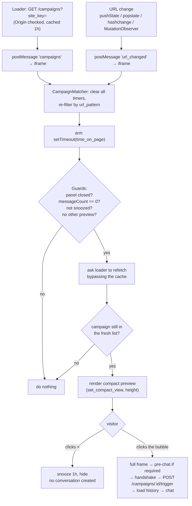

# Proactive campaigns

A campaign is a message that invites the visitor to chat **before** they have opened the panel: after they
have spent N seconds on a URL that matches a pattern, a small bubble appears near the launcher with the
message and the sender's name/avatar. Nothing is created in the inbox until the visitor clicks it.

- [Configuration (admin)](#configuration-admin)
- [How matching works](#how-matching-works)
- [The preview → conversation flow](#the-preview--conversation-flow)
- [Guards, snooze, and idempotency](#guards-snooze-and-idempotency)
- [Current limitations](#current-limitations)
- [Why a campaign doesn't fire](#why-a-campaign-doesnt-fire)

---

## Configuration (admin)

Done **in the Cluvix app**, per livechat site. Four admin endpoints back it:

| Method | Path | Purpose |
|---|---|---|
| GET | `/config/omni-channel/livechat/:accountId/campaigns` | List the site's campaigns (paginated, newest first). |
| POST | `/config/omni-channel/livechat/:accountId/campaigns` | Create. |
| PUT | `/config/omni-channel/livechat/campaigns/:id` | Update. |
| DELETE | `/config/omni-channel/livechat/campaigns/:id` | Delete (hard delete — a campaign is display configuration, nothing references it). |

Fields:

| Field | Type | Rules |
|---|---|---|
| `title` | string | Required, non-blank. Internal label — **not** shown to the visitor. |
| `message` | string | Required, non-blank. This is what the visitor sees, and it becomes the opening message in the conversation. |
| `trigger_url_pattern` | string | Required. Must start with `http://` or `https://`. May contain `*`. See [matching](#how-matching-works). |
| `time_on_page_sec` | int | ≥ 0, default `0`. Seconds the visitor must stay on a matching URL. |
| `sender_user_id` | int | Optional. Must be a user of the same company **and** currently active — a user who has left (soft-deleted) is rejected. Their name and avatar are shown on the preview. |
| `enabled` | bool | Default `false` on create. Only `enabled` campaigns are ever sent to a widget. |
| `only_business_hours` | bool | Default `false`. **Stored but not enforced** — see [limitations](#current-limitations). |

The account is scoped to the active company before anything else, and `company_id`/`account_id` are locked
on update, so a campaign can never be moved between sites or tenants.

---

## How matching works

The widget fetches the list once and matches entirely **client-side**. There is no server round-trip per
page view.

**1. Fetching.** The loader calls `GET /api/client/livechat/campaigns?site_key=…`. This endpoint takes no
JWT — a campaign must be able to appear before any conversation exists — so its gate is the same as the
handshake's: valid `site_key` **and** an `Origin` in the site's allow-list, with the same generic 403 on
failure. Only `enabled` campaigns are returned, and only these fields: `id`, `url_pattern`,
`time_on_page`, `only_business_hours`, `message`, `sender` (`{name, avatar}` or `null`).

The response carries `Cache-Control: private, max-age=3600`, and the loader additionally caches the list in
`localStorage` under `cluvix_lc_campaigns_<siteKey>` as `{ts, list}` for **1 hour**. A fetch failure is
swallowed silently — campaigns are an add-on and must never break the core chat.

**2. Tracking the URL.** The loader posts `url_changed` to the iframe whenever the address changes,
including in single-page apps that never reload:

- `history.pushState` and `history.replaceState` are wrapped (the check is deferred with `setTimeout(0)`
  because `location.href` updates synchronously but nested calls shouldn't each trigger a comparison);
- `popstate` and `hashchange` are listened to;
- a `MutationObserver` on `<body>` (coalesced to one check per 50 ms) catches routers that use none of the
  above.

Identical consecutive URLs are not re-sent.

**3. Matching.** For each campaign, on every URL change:

- if `url_pattern` ends with `/`, a `*` is appended — so `https://site.com/pricing/` also matches
  `/pricing/plans` and `/pricing/?ref=x`. Without that, an admin would have to write the exact URL;
- the pattern is tested with the browser's **`URLPattern`** API when available (Chromium, Safari 17.4+,
  Firefox 126+);
- otherwise — and if `URLPattern` throws on the pattern — a glob fallback is used: everything is regex-
  escaped except `*`, which becomes `.*`, and the whole URL must match end to end. No polyfill is bundled,
  deliberately: an older browser loses campaigns, not chat.

**4. Timing.** Every matching campaign arms a `setTimeout` for `time_on_page × 1000` ms (`0` fires on the
next tick). **On every URL change all timers are cleared first**, then re-armed for the new URL — so
`time_on_page` measures time on *that* URL, not time on the site.



---

## The preview → conversation flow

**Rendering.** The preview is a small bubble that replaces the panel's area, sized to its own content: the
iframe measures the rendered block and asks the loader to resize the frame to that height (minimum 60 px).
The loader owns the Shadow DOM, so the loader performs the resize; `isOpen` stays **false** — a preview is
not an open chat, and no handshake happens.

The whole bubble is a real `<button>` (keyboard-reachable, with an `aria-label` combining sender and
message, truncated to 80 characters); the dismiss `×` is a separate button. A sender avatar goes through
the same https-only check as `logo_url`, and falls back to the sender's initial if the image fails.

If `sender` is `null` (no `sender_user_id`, or that user has no name), the preview falls back to the site's
`launcher_label`, then to the localized default brand name.

**Clicking.** In order:

1. the app marks the campaign as pending-trigger and asks the loader for the **full** frame — the loader
   switches to it *before* the handshake runs, so a pre-chat form never flashes inside the small bubble;
2. if the pre-chat form is required and not already completed, it is shown; submitting it produces the
   handshake with `pre_chat`;
3. the handshake runs and returns a `conversation_id` + JWT;
4. `POST /api/client/livechat/campaigns/:id/trigger` creates the opening message, **before** history is
   loaded — so the campaign message is already there when the list renders;
5. the chat opens normally.

Step 4 is best-effort: a failure does not block the chat from opening (the backend's own behaviour is
idempotent and safe either way).

---

## Guards, snooze, and idempotency

A due campaign is only shown when **all** of these hold:

| Guard | Why |
|---|---|
| The panel is closed. | Never interrupt an open conversation. |
| No message in this session (`messageCount === 0`, synced up from loaded history). | Never invite someone who is already talking to you. |
| Not snoozed. | The visitor dismissed a preview within the last hour. |
| No other preview showing or pending. | One invitation at a time. |
| The campaign is still in a **freshly fetched** list. | Between the cached fetch and the timer firing, an admin may have disabled the campaign. Before showing, the app asks the loader to refetch **bypassing the cache** and only proceeds if the campaign is still there. |

**Snooze.** Dismissing with `×` writes `cluvix_lc_snooze_<siteKey>` (absolute expiry timestamp) into the
iframe origin's `localStorage` for **1 hour**, closes the preview, and creates nothing. Opening the
launcher while a preview is showing is *not* a dismissal: the preview is cancelled without snoozing.

**Trigger idempotency** is enforced server-side, not by trusting the client:

- the whole trigger runs in a transaction that takes a **row lock** (`FOR UPDATE`) on the conversation;
- the guard is "this conversation has **no messages yet**". A second click, a second tab, or two concurrent
  requests all wait on the lock, then see a non-zero count and return `triggered: false` without writing;
- the campaign is resolved **scoped to the conversation's own company and account** (taken from the locked
  row, never from the request), so a campaign id from another site or tenant returns `404`;
- a disabled campaign also returns `404`;
- `conversation_id` comes from the visitor JWT, never from the request body.

---

## Current limitations

- **`only_business_hours` is stored but not applied.** The widget's `inBusinessHours()` returns `true`
  unconditionally: the widget has no real working-hours source yet (only the static `offline_text`). The
  function is kept as a seam so real hours can be wired in later without touching the call site. Set the
  flag if you like — today it changes nothing.
- **Website campaigns only.** Matching is URL + time-on-page. There is no audience segmentation, no
  frequency cap beyond the one-hour snooze, and no scheduling window.
- **One opening message.** A campaign creates a single message; it is not a sequence or a bot flow.
- **Fires at most once per conversation.** The idempotency guard is "the conversation has no messages", so
  a campaign cannot re-fire into a conversation that already has any history.
- **No campaign analytics** in this repository — impressions/clicks are not reported back by the widget.
- **`URLPattern` is not polyfilled.** On browsers without it, matching falls back to a simple glob over the
  full URL; patterns relying on `URLPattern`-specific syntax (named groups, regex groups) will not behave
  the same there.
- **The list is cached for an hour.** A newly created or edited campaign can take up to 60 minutes to
  reach a visitor who already has the list cached — except at the moment a preview is about to show, where
  the bypass-cache re-check applies (so *disabling* a campaign takes effect quickly, but *enabling* one
  does not).

---

## Why a campaign doesn't fire

Work down the list; each step tells you where to stop.

1. **Is it enabled?** Only `enabled` campaigns are returned at all.

   ```bash
   curl -s -H 'Origin: https://ALLOWED_ORIGIN' \
     'https://YOUR_HOST/api/client/livechat/campaigns?site_key=YOUR_SITE_KEY'
   ```

   An empty `campaigns` array means nothing is enabled. A **403** means the `site_key` or `Origin` gate
   failed — same causes as [the handshake](./TROUBLESHOOTING.md#not-connecting--403).

2. **Is the list cached from before you enabled it?** Clear it on the host page and reload:

   ```js
   localStorage.removeItem('cluvix_lc_campaigns_YOUR_SITE_KEY');
   ```

3. **Does the pattern match?** Test the exact rule the widget uses, in the browser Console:

   ```js
   const url = location.href;
   let p = 'https://site.com/pricing/';           // your trigger_url_pattern
   if (p.endsWith('/')) p += '*';
   'URLPattern' in globalThis ? new URLPattern(p).test(url) : 'no URLPattern — glob fallback';
   ```

   Remember the pattern must include the scheme, and matching is against the **full** URL including query
   and hash.

4. **Are you waiting long enough, on the same URL?** `time_on_page_sec` restarts on every URL change,
   including SPA navigation and hash changes.

5. **Is a guard blocking it?** The panel must be closed, the session must have **no** messages, and there
   must be no snooze. If you dismissed a preview in the last hour, clear the snooze from the **iframe's**
   Console context (DevTools → Console → frame selector → `widget.html`):

   ```js
   localStorage.removeItem('cluvix_lc_snooze_YOUR_SITE_KEY');
   ```

6. **Did the bypass-cache re-check drop it?** If the campaign was disabled between your first fetch and the
   timer firing, the preview is correctly suppressed. Re-run step 1.

7. **Does the browser support the pattern?** Check `'URLPattern' in window`. On a browser without it, only
   plain `*` globs work.

---

## See also

- [How it works §7](./HOW_IT_WORKS.md#7-proactive-campaigns) — where campaigns sit in the overall flow.
- [Operations](./OPERATIONS.md) — site configuration and deployment.
- [Troubleshooting](./TROUBLESHOOTING.md) — everything that is not campaign-specific.
