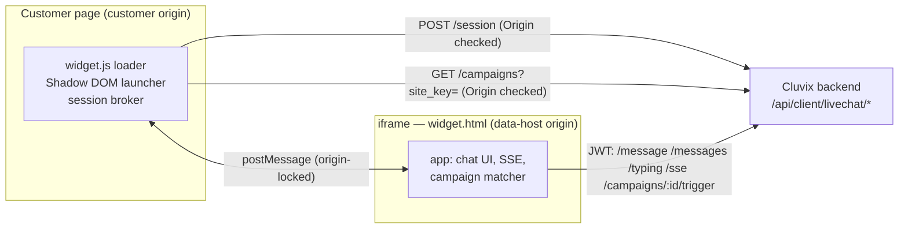
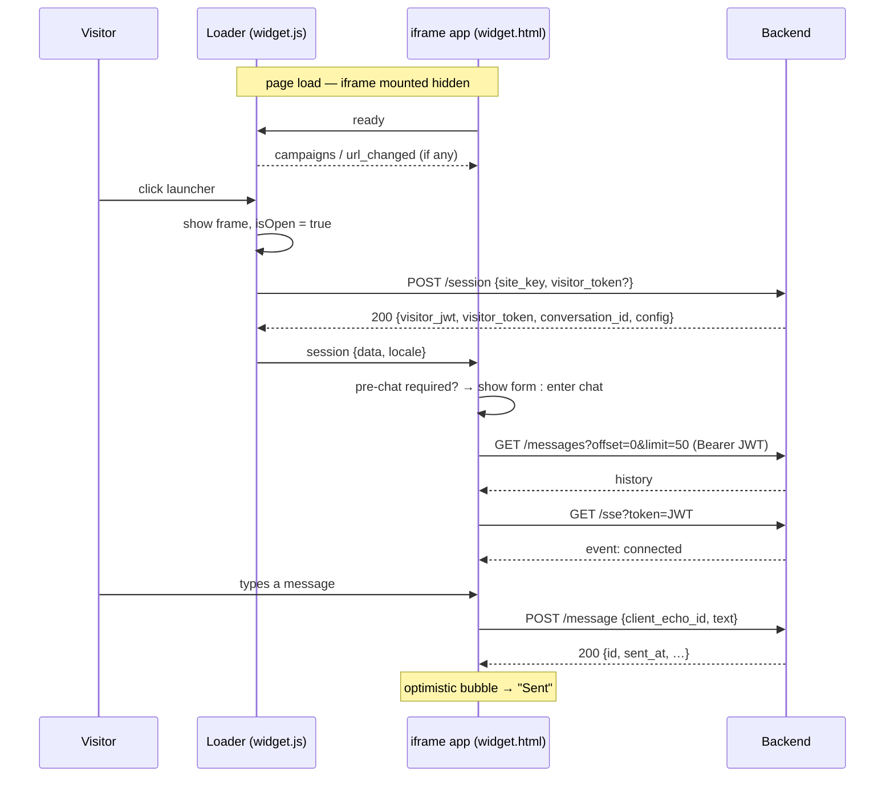
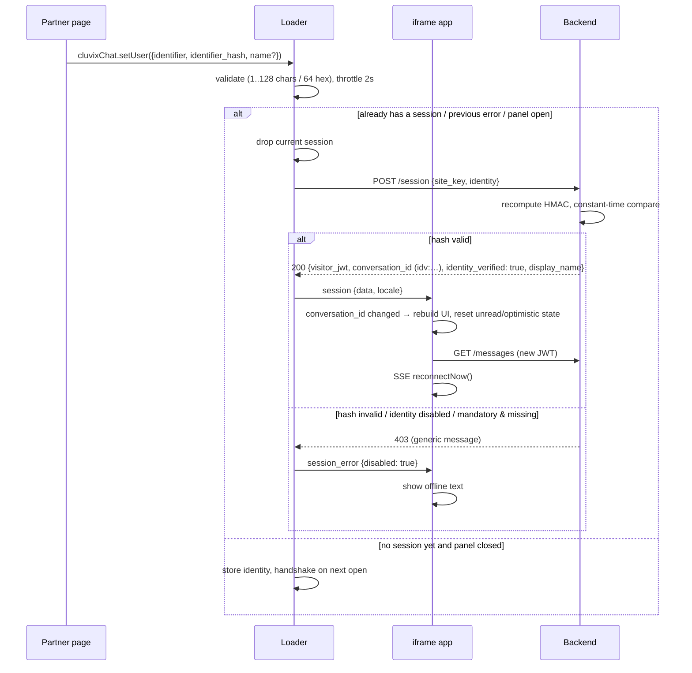

# How it works

End-to-end walkthrough of what happens between a visitor loading your page and a staff reply arriving in
their browser. Everything here is derived from the code in this repository (`src/`) and from the public
API it talks to; where a value is a backend constant it is named as such.

> Terminology: **loader** = `widget.js`, running on the customer's page (customer origin). **app** =
> `widget.html` + its bundle, running inside the iframe (backend origin, i.e. `data-host`). **admin** =
> the Cluvix web app, where a clinic administrator configures the site.

- [1. Page load → launcher](#1-page-load--launcher)
- [2. Opening the panel → handshake](#2-opening-the-panel--handshake)
- [3. Pre-chat → first message](#3-pre-chat--first-message)
- [4. Realtime (SSE)](#4-realtime-sse)
- [5. Staff replies](#5-staff-replies)
- [6. Identity (`setUser`)](#6-identity-setuser)
- [7. Proactive campaigns](#7-proactive-campaigns)
- [8. Client-side storage](#8-client-side-storage)
- [9. Rate limits and hard limits](#9-rate-limits-and-hard-limits)
- [10. Locale, theme, dark mode](#10-locale-theme-dark-mode)
- [postMessage reference](#postmessage-reference)

---

## Why two bundles

`POST /session` is guarded by an `Origin` allow-list configured per site. Only a request made **from the
customer page** carries that `Origin`. The iframe is served from the Cluvix origin, so a handshake made
from inside the iframe would always be rejected. Therefore:

- the **loader** owns the handshake, the resume token, identity, and the campaign list;
- the **app** owns the conversation UI and everything that needs the visitor JWT (`/message`,
  `/messages`, `/typing`, `/sse`, `/campaigns/:id/trigger`) — those endpoints are authenticated by the
  JWT and do **not** check `Origin`;
- the two talk over an origin-locked `postMessage` channel (`cluvix-livechat`).



---

## 1. Page load → launcher

1. The `<script src=".../widget.js" data-site-key="..." data-host="..." async>` tag executes.
2. `readBootstrap()` (`src/loader/bootstrap.ts`) reads the attributes off `document.currentScript` (or,
   for an async tag that lost `currentScript`, `script[data-site-key][src*="widget.js"]`):
   - `data-site-key` — required. Missing → `console.error` and the widget does **not** mount.
   - `data-host` — optional. Must be a bare origin (`u.origin === value`: no path, query, hash or
     credentials). `https:` is always accepted; `http:` only for `localhost` / `127.0.0.1`. Invalid →
     `console.error` and the widget does **not** mount. Omitted → the origin `widget.js` was served from.
   - `data-user-id` / `data-user-hash` / `data-user-name` / `data-user-phone` / `data-user-email` —
     optional identity. `identifier` must be 1–128 chars, `identifier_hash` exactly 64 hex characters
     (case-insensitive, lower-cased internally). Invalid → `console.error` and the session falls back to
     anonymous.
3. `createState()` builds the single `LoaderState`, including the storage keys
   (`cluvix_lc_token_<siteKey>`, `cluvix_lc_open_<siteKey>`, `cluvix_lc_cfg_<siteKey>`,
   `cluvix_lc_campaigns_<siteKey>`) and the initial locale/theme (from the cached config, see
   [§10](#10-locale-theme-dark-mode)).
4. On `DOMContentLoaded` (or immediately if the document is already parsed), `mount()`:
   - appends the Shadow DOM host to `<body>` — CSS isolation from the host page, both directions;
   - paints the launcher with the **cached** theme, so the button looks right before any network call;
   - starts campaign URL tracking and fetches the campaign list (independent of the handshake);
   - **eagerly mounts the iframe, hidden** (`frameWrap.hidden` stays true). This is required so the
     campaign timers inside the app can run while the widget is closed. A hidden iframe does *not*
     handshake — see the `ready` row in the [postMessage reference](#postmessage-reference);
   - sets `mounted = true`, fires `cluvix-chat:ready`, then drains any `window.cluvixChat` calls that
     were queued before mount;
   - restores the open state if the previous tab left it open (`cluvix_lc_open_<siteKey> === '1'`) —
     **desktop only** (`matchMedia('(max-width: 480px)')` false), so a phone screen is never hijacked.

No handshake, no conversation, and no cookie has been created at this point.

---

## 2. Opening the panel → handshake

Opening happens from the launcher click, `window.cluvixChat.open()`, or a campaign preview click.
`frame.open()` shows the full frame and then calls `ensureSession()`, which runs the handshake unless one
is already in flight or a session already exists.

`POST {data-host}/api/client/livechat/session`, `Content-Type: application/json`:

```json
{ "site_key": "…", "visitor_token": "…", "pre_chat": { "name": "…", "phone": "…" }, "identity": { "…": "…" } }
```

- `visitor_token` is sent only when there is no identity (identity and a stored anonymous token are never
  sent together — the backend would ignore the token anyway).
- `pre_chat` is present only on the handshake that follows a pre-chat submit.

Server-side order (`internal/modules/public/livechat/handler.go`):

1. parse body → `site_key` required;
2. `site_key` **format** check (1–64 chars, `[A-Za-z0-9_-]`) *before* touching Redis or the DB;
3. rate limit on `(site_key, IP)`;
4. resolve the site from `site_key`;
5. site `status` must be `connected`;
6. `Origin` header must match `allowed_origins` (both sides normalized: lower-cased, trailing slash
   stripped, default port `:443`/`:80` stripped). A missing `Origin`, or an empty allow-list, is a
   rejection;
7. pre-chat validation (name ≤ 100 runes, phone must be a valid mobile number when present);
8. identity verification, when applicable ([§6](#6-identity-setuser));
9. resume-or-create the conversation, optionally auto-link an existing customer by phone;
10. sign the visitor JWT (HS256, `aud = livechat-visitor`, `sub` = conversation id, **TTL 1 hour**).

Every failure in steps 4–8 returns the **same** generic 403 body. The real reason is only in the server's
security log (`livechat_site_rejected` / `livechat_identity_rejected`), never in the response — see
[Troubleshooting](./TROUBLESHOOTING.md#not-connecting--403).

Response `.data` carries `visitor_jwt`, `visitor_token`, `conversation_id`, `identity_verified`,
`display_name`, and `config` (`widget_theme`, `pre_chat_form`). The loader caches the config, applies the
theme to the launcher, and posts `session` (with the resolved locale) into the iframe.



---

## 3. Pre-chat → first message

The pre-chat form is shown when `pre_chat_form.enabled` **and** at least one of `require_name` /
`require_phone` / `require_message` is true **and** the "pre-chat done" flag for this `site_key` is not
set.

- Validation is client-side for immediate feedback; the backend remains the source of truth. Name: at
  least one non-blank character. Phone: `phone_region === 'INTL'` → E.164 only (`^\+?[1-9]\d{6,14}$`);
  otherwise a Vietnamese mobile (`^(?:\+84|0)(?:3|5|7|8|9)\d{8}$`) **or** E.164. Spaces, dots, dashes and
  parentheses are stripped before matching. Message: at least one non-blank character.
- The **Send message** button stays disabled until every *shown* field validates. `Enter` in the message
  field submits (`Shift+Enter` inserts a newline).
- On submit the app posts `handshake` with `pre_chat: {name?, phone?}` to the loader. The typed message
  is **not** part of the handshake (the API has no field for it): it is held in memory and sent as the
  first `POST /message` immediately after entering the chat, guarded by a `firstMessageSent` flag so a
  later re-handshake cannot duplicate it.
- Sending is optimistic: a bubble appears immediately with a client-generated `client_echo_id`
  (`crypto.randomUUID()` where available). On success the bubble is acknowledged with the server id and
  shows "Sent"/"Đã gửi". On HTTP failure or `429` it shows "Failed · tap to retry" and keeps the same
  `client_echo_id`, so a retry is deduplicated server-side. On `401` (JWT expired) the bubble stays in the
  "sending" state, a re-handshake is requested, and the message is replayed once the new JWT arrives —
  invisible to the visitor.

---

## 4. Realtime (SSE)

After history loads, the app opens `GET /api/client/livechat/sse?token=<visitor_jwt>` with `EventSource`
(the JWT rides in the query string because `EventSource` cannot set an `Authorization` header).

| Event | Meaning | App behaviour |
|---|---|---|
| `connected` | Stream established. | Marks the header dot "online", resets backoff. If the previous disconnect lasted **> 3 s**, refetches history to fill the gap. |
| `new_message` | A staff message. Payload `{message: …}`. | Appends the bubble, increments unread when the panel is closed, and notifies the loader (`staff_message`) so it emits `cluvix-chat:message` — metadata only, **never** message content. |
| `staff_typing` | Staff is typing. | Shows the typing indicator. |
| `:ping` | SSE comment heartbeat, every **25 s**. | Ignored by `EventSource` per spec; it exists so a reverse proxy does not close an idle stream. |
| `expired` | Sent by the server on the heartbeat tick after the JWT's expiry, right before the stream closes. | Requests a re-handshake immediately, rather than inferring expiry from connection errors. |

Reconnection is managed by the widget, not by `EventSource`'s built-in retry (which cannot change the URL
and would keep reusing the dead JWT): on `error` the stream is closed and reconnected with exponential
backoff **2 s → 30 s** (doubling, capped). Two consecutive failures *before* ever reaching `connected` are
treated as a suspect JWT and trigger a re-handshake. `reconnectNow()` (used when a new session arrives)
resets the backoff and reconnects at once.

Server-side, the stream is also bounded: subscriptions are capped per IP and in total, and a connection
that receives no event for the idle timeout is closed by a sweeper — see
[§9](#9-rate-limits-and-hard-limits).

---

## 5. Staff replies

A staff member answers in the Cluvix Omnichat inbox (**in the Cluvix app** — outside this repository).
The backend persists the message and publishes it to the visitor's SSE stream, which delivers
`new_message`. If the panel is closed, the app posts `unread` to the loader, which draws the badge
(capped at `9+`). Reopening the panel resets unread to 0.

Two independent guards keep internal notes (`src = 2`) away from the visitor: one before the SSE publish,
and one in the history query. The widget also refuses to render `src = 2` defensively.

---

## 6. Identity (`setUser`)

Anonymous is the default. With identity, the same person gets the same conversation across devices.

- Your **server** computes `identifier_hash = hex(HMAC-SHA256(identity_secret, identifier))`. The secret
  never reaches the browser.
- The page supplies `(identifier, identifier_hash)` via `data-user-*` or `window.cluvixChat.setUser({…})`.
- The backend recomputes the HMAC and compares it in constant time. On success the conversation key is
  `idv:` + `hex(sha256(identifier))` — the identifier itself is never stored, so the conversation cannot
  be reversed back to an email.
- Any supplied `visitor_token` is **ignored** whenever `identity` is present: otherwise anyone with a
  valid identity could hop into an anonymous conversation whose token they happened to know.
- `name` / `phone` / `email` inside `identity` are **not** covered by the signature. They are treated as
  hints and only fill blanks; they never overwrite a name staff has already corrected. `email` is accepted
  by the API but not persisted in v2.
- If the site has `identity_mandatory` on, a handshake without `identity` is rejected. If the site has
  identity **disabled** and the page sends `identity`, that is also rejected — never silently downgraded
  to anonymous, because the page would then believe it is authenticated when it is not.
- `setUser` is throttled to once per 2 s, and is a no-op when both `identifier` and `identifier_hash`
  match the identity already in effect *and* the previous handshake did not fail.
- Identity is held **in memory only** — never in `localStorage`/`sessionStorage`. A reload without
  re-supplying it starts a fresh anonymous session. Likewise, the `visitor_token` returned for an
  authenticated session is **not** stored: an authenticated session resumes by identifier, not by token.



---

## 7. Proactive campaigns

Summarised here; the full behaviour is in [CAMPAIGNS.md](./CAMPAIGNS.md).

1. The loader fetches `GET /campaigns?site_key=` (no JWT — the campaign must be able to appear *before*
   any conversation exists) and caches the list in `localStorage` for **1 hour**.
2. It posts the list to the iframe, plus the current URL, and keeps posting `url_changed` as the host page
   navigates — including SPA navigation (`pushState`/`replaceState` are wrapped, `popstate`/`hashchange`
   are listened to, and a `MutationObserver` covers routers that use none of those).
3. The app matches `url_pattern` against the URL and arms a timer for `time_on_page` seconds.
4. When a timer fires and the guards pass (panel closed, no message in this session, not snoozed, no other
   preview pending), the app asks the loader to **refetch the list bypassing the cache**, so a campaign an
   admin just disabled is not shown, and then renders a compact preview — a small bubble with the message
   and sender, sitting where the panel would be. No conversation is created.
5. Clicking the preview opens the full panel (pre-chat first if required), handshakes, then calls
   `POST /campaigns/:id/trigger`, which creates the opening message exactly once. Dismissing with **X**
   snoozes campaigns for this site for **1 hour**.

---

## 8. Client-side storage

Nothing here is a cookie, and nothing is third-party. Keys are namespaced per `site_key`.

| Key | Where | Written by | Lifetime | Purpose |
|---|---|---|---|---|
| `cluvix_lc_token_<siteKey>` | `sessionStorage` when `pre_chat_form.enabled`, otherwise `localStorage` | loader | tab session / **30 days** (stored as `{token, ts}`, checked on read) | Resume an anonymous conversation. Never written for an authenticated (identity) session. |
| `cluvix_lc_open_<siteKey>` | `localStorage` | loader | until cleared | Remember the open/closed panel state (restored on desktop only). |
| `cluvix_lc_cfg_<siteKey>` | `localStorage` | loader | until cleared | Cached `config` so the launcher paints with the right colour/label before the handshake returns. |
| `cluvix_lc_campaigns_<siteKey>` | `localStorage` | loader | **1 hour** (`{ts, list}`) | Campaign list cache. |
| `cluvix_lc_prechat_<siteKey>` | `sessionStorage` when `pre_chat_form.enabled`, otherwise `localStorage` | app (iframe origin) | tab session / until cleared | "Pre-chat already completed", so the form is not asked again. Read falls back to the other storage for backwards compatibility. |
| `cluvix_lc_snooze_<siteKey>` | `localStorage` (iframe origin) | app | **1 hour** (absolute timestamp) | Campaign snooze after the visitor dismisses a preview. |

The split between `sessionStorage` and `localStorage` is deliberate: on a site with a pre-chat form the
conversation is likely to contain personal or medical detail, so on a **shared computer** the next person
must not be able to resume it from disk. Every access is wrapped in `try/catch` — with storage blocked
(private mode, hardened settings) the widget still works for the current session, it just cannot resume.

---

## 9. Rate limits and hard limits

Backend values, from `pkg/define/omni_channel.go`. The ones marked *env* can be overridden per deployment
(see [Operations](./OPERATIONS.md#backend-environment)).

| Limit | Value | Scope |
|---|---|---|
| Handshake `POST /session` (and `GET /campaigns`, same bucket) | **120 / minute** *(env `LIVECHAT_RATE_SESSION_IP`)* | `(site_key, IP)` |
| Visitor messages | **10 / minute** *(env `LIVECHAT_RATE_VISITOR`)* | conversation |
| Visitor messages | **30 / minute** *(env `LIVECHAT_RATE_IP`)* | `(site_key, IP)` |
| History reads `GET /messages` | **60 / minute** *(env `LIVECHAT_RATE_READ`)* | conversation |
| Rate-limit window | **60 s** sliding | — |
| `typing` throttle | **1 per 3 s** | conversation — over the limit is a silent `200` no-op, deliberately not a `429` |
| Message text | **4000 runes** | counted in runes, not bytes, so Vietnamese diacritics are not truncated to a third |
| `client_echo_id` | **≤ 64 chars**, `[A-Za-z0-9_-]` | — |
| Pre-chat name | **≤ 100 runes** | — |
| `site_key` | **≤ 64 chars**, `[A-Za-z0-9_-]` | validated before any Redis/DB access |
| `GET /messages` `offset` | clamped to **5000**; `limit` outside 1..100 falls back to 50 | clamped, not rejected, so an old widget never breaks |
| Anonymous resume age | **30 days** | a `visitor_token` older than this opens a *new* conversation |
| SSE connections | **3 per IP**, **2000 total** *(env `VISITOR_SSE_MAX_CONN_PER_IP`, `VISITOR_SSE_TOTAL_CAP`)* | over the cap → `429` |
| SSE idle close | **15 minutes** without an event | server closes the stream; the widget reconnects |
| SSE heartbeat | `:ping` every **25 s** | — |
| Visitor JWT TTL | **1 hour** | there is no revocation list; a disabled site is instead blocked at every authenticated endpoint |

Two design decisions worth knowing when you read the numbers:

- **Rate limiting fails open.** If Redis is unavailable, requests are allowed rather than blocked — a
  broken counter must not take the whole chat down.
- **The per-IP tier switches itself off when the IP is untrustworthy.** Behind a reverse proxy with
  `TRUSTED_PROXIES` unset, every request would look like `127.0.0.1`; rather than turning "per-IP" into
  one global bucket that locks out real visitors, the code treats a loopback/empty IP as "unknown", skips
  the IP tier, and logs one warning per process. The non-IP tiers (per conversation, per site) still
  apply. This is why `TRUSTED_PROXIES` matters.

---

## 10. Locale, theme, dark mode

**Locale** is resolved once, first match wins: `widget_theme.locale` (set by the admin) → the host page's
`<html lang>` → `navigator.language` → `vi`. Only the loader can read the host page's `lang` (the iframe
is cross-origin), so the loader resolves it and ships it with the `session` message; the app sets
`document.documentElement.lang` accordingly and formats message times with `Intl.DateTimeFormat` for that
locale. Values are matched on the base subtag, so `en-GB` resolves to `en`. Supported: `vi` (default) and
`en`, both LTR.

**Theme.** `widget_theme` comes from the handshake; the loader also keeps the last one in
`cluvix_lc_cfg_<siteKey>` so the launcher is painted correctly before the network answers. Anything the
theme does not set falls back to the locale-appropriate default (`primary_color: #1677ff`,
`position: right`, and the localized greeting/offline strings). `launcher_offset_x/y` are rounded and
clamped to `0..200`, defaulting to `20`; a non-finite value falls back to the default.

**Contrast.** `primary_color` is used as given only for details that carry no text (focus ring,
highlights). For any surface with text, the widget darkens the colour in 1% steps (max 50 steps, i.e. down
to about 60% of the original lightness) until white text reaches WCAG 2.1 AA (4.5:1), then picks white or
`#111827`, whichever contrasts better. Very light brand colours are not darkened past recognition — they
keep their colour and get dark text instead. Relative luminance follows the WCAG definition
(sRGB linearization, `0.2126R + 0.7152G + 0.0722B`), not the old YIQ approximation.

**Dark mode.** All neutrals are CSS custom properties with a dark palette. `color_scheme: 'auto'`
(default) follows the visitor's OS via `prefers-color-scheme`; `'light'`/`'dark'` pin it by setting
`data-lc-scheme` on the iframe's root element. The unread badge ring follows the same decision, so it does
not show up as a stray white halo on a dark page.

**Mobile.** Below 480 px the panel is full-screen and the loader pins it to `window.visualViewport`, so
the composer stays above the iOS on-screen keyboard (iOS Safari does not shrink the layout viewport when
the keyboard opens). Compact campaign previews and desktop keep the plain CSS layout.

---

## postMessage reference

Channel: every message carries `channel: 'cluvix-livechat'`; anything else is ignored (other iframes and
browser extensions post messages too). Both sides pin an origin: the loader only accepts messages whose
`event.origin` equals the widget origin, and the app locks `trustedOrigin` from the first valid message it
receives and rejects any later message from a different origin. The app never posts to `'*'`; before an
origin is known, only the initial `ready` may use a `document.referrer`-derived guess, and it is skipped
entirely when there is no referrer.

### iframe → loader

| Type | Payload | Meaning / loader reaction |
|---|---|---|
| `ready` | — | The app has mounted. The loader marks the iframe ready, flushes any pending focus, re-sends the current `session` or `session_error`, re-sends `opened` if the panel is already open, and re-sends the campaign list + URL. It deliberately does **not** handshake here — the iframe is mounted eagerly on every page load, so handshaking on `ready` would create a conversation for every visitor who never opened the chat. |
| `handshake` | `pre_chat?: {name?, phone?}` | Request a (re)handshake: pre-chat submit, or a JWT refresh (no payload). If the panel is closed the loader shows the full frame first, so the pre-chat form never flashes inside a compact preview. |
| `close` | — | The visitor pressed the in-panel close button (or `Escape`). |
| `unread` | `count` | Unread count while the panel is closed → badge. |
| `campaign_ready` | `campaignId` | Observability signal only — a campaign came due. The preview flow is handled entirely inside the iframe. |
| `set_compact_view` | `height` | Resize the frame to a compact preview of that height (min 60 px). The loader owns the Shadow DOM, so it performs the resize; `isOpen` stays `false`. |
| `exit_compact_view` | `reason?: 'open' \| 'dismiss'` | `'open'` → switch to the full frame immediately (before the handshake runs). `'dismiss'`/absent → hide the frame, widget stays closed. |
| `refetch_campaigns` | — | Refetch the campaign list bypassing the cache; the result comes back as a normal `campaigns` message. |
| `staff_message` | `id`, `sent_at` | A staff message arrived over SSE. The loader emits `cluvix-chat:message` with `{conversation_id, sent_at}` — deliberately metadata only, never content, and never internal notes. |

### loader → iframe

| Type | Payload | Meaning |
|---|---|---|
| `session` | `data: SessionData`, `locale?` | Handshake succeeded. Carries `visitor_jwt`, `conversation_id`, `config`, `identity_verified`, `display_name`. A changed `conversation_id` makes the app rebuild its UI and reload history. |
| `session_error` | `disabled: boolean` | Handshake failed. `disabled: true` (403 / no envelope) → show the site's `offline_text`; otherwise the generic "could not connect" string. |
| `opened` | — | The panel was opened (including via the public API). Resets unread, focuses the composer if already in chat. |
| `closed` | — | The panel was closed from outside. |
| `campaigns` | `list: CampaignPreview[]` | The `enabled` campaign list — sent on every fresh fetch *and* on a cache hit, so the app can re-evaluate against the current URL. |
| `url_changed` | `url` | The host page's URL changed (including SPA navigation). The app clears all campaign timers and re-arms them for the new URL. |

### Public events on `window` (host page)

`cluvix-chat:ready`, `cluvix-chat:opened`, `cluvix-chat:closed`, `cluvix-chat:message`. Only `message`
carries a `detail`: `{conversation_id, sent_at}`. See the [Public JS API](../README.md#public-js-api).

---

## See also

- [Operations](./OPERATIONS.md) — creating a site, environment, nginx, deploy, rollback.
- [Troubleshooting](./TROUBLESHOOTING.md) — symptom → cause → check → fix.
- [Campaigns](./CAMPAIGNS.md) — proactive message configuration and matching rules.
- [README](../README.md) — embedding, data attributes, API contract, security notes.
