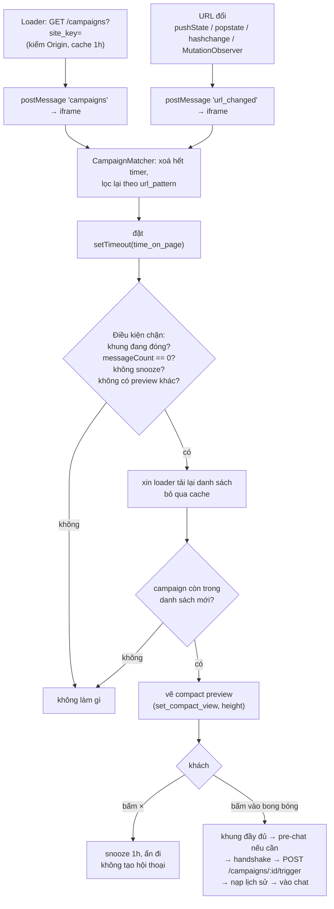

# Chiến dịch chủ động

Chiến dịch là một tin mời khách trò chuyện **trước khi** họ mở khung chat: sau khi họ ở lại N giây trên một
URL khớp mẫu, một bong bóng nhỏ hiện cạnh nút mở chat, mang nội dung tin và tên/avatar người gửi. Không có
gì được tạo trong hộp thư cho tới khi khách bấm vào.

- [Cấu hình (admin)](#cấu-hình-admin)
- [Cơ chế khớp](#cơ-chế-khớp)
- [Luồng preview → hội thoại](#luồng-preview--hội-thoại)
- [Điều kiện chặn, snooze và idempotency](#điều-kiện-chặn-snooze-và-idempotency)
- [Giới hạn hiện tại](#giới-hạn-hiện-tại)
- [Vì sao campaign không nổ](#vì-sao-campaign-không-nổ)

---

## Cấu hình (admin)

Làm **trong app Cluvix**, theo từng site livechat. Bốn endpoint quản trị đứng sau:

| Method | Path | Mục đích |
|---|---|---|
| GET | `/config/omni-channel/livechat/:accountId/campaigns` | Liệt kê campaign của site (phân trang, mới nhất trước). |
| POST | `/config/omni-channel/livechat/:accountId/campaigns` | Tạo. |
| PUT | `/config/omni-channel/livechat/campaigns/:id` | Cập nhật. |
| DELETE | `/config/omni-channel/livechat/campaigns/:id` | Xoá (xoá cứng — campaign là cấu hình hiển thị, không bảng nào tham chiếu tới nó). |

Các trường:

| Trường | Kiểu | Luật |
|---|---|---|
| `title` | string | Bắt buộc, không rỗng. Nhãn nội bộ — **không** hiện cho khách. |
| `message` | string | Bắt buộc, không rỗng. Đây là thứ khách nhìn thấy, và cũng trở thành tin mở đầu trong hội thoại. |
| `trigger_url_pattern` | string | Bắt buộc. Phải bắt đầu bằng `http://` hoặc `https://`. Có thể chứa `*`. Xem [cơ chế khớp](#cơ-chế-khớp). |
| `time_on_page_sec` | int | ≥ 0, mặc định `0`. Số giây khách phải ở lại trên một URL khớp. |
| `sender_user_id` | int | Tuỳ chọn. Phải là user cùng công ty **và** đang hoạt động — người đã nghỉ (xoá mềm) sẽ bị từ chối. Tên và avatar của họ hiện trên preview. |
| `enabled` | bool | Mặc định `false` khi tạo. Chỉ campaign `enabled` mới được gửi tới widget. |
| `only_business_hours` | bool | Mặc định `false`. **Có lưu nhưng chưa áp dụng** — xem [giới hạn](#giới-hạn-hiện-tại). |

Account được scope theo công ty đang hoạt động trước mọi thứ khác, và `company_id`/`account_id` bị khoá khi
cập nhật, nên một campaign không bao giờ bị chuyển giữa các site hoặc giữa các tenant.

---

## Cơ chế khớp

Widget tải danh sách một lần rồi khớp hoàn toàn **phía client**. Không có lượt gọi server nào cho mỗi lượt
xem trang.

**1. Tải danh sách.** Loader gọi `GET /api/client/livechat/campaigns?site_key=…`. Endpoint này không nhận
JWT — campaign phải xuất hiện được trước khi có hội thoại nào — nên cổng bảo vệ giống hệt handshake:
`site_key` hợp lệ **và** một `Origin` nằm trong danh sách cho phép của site, cùng một 403 chung khi thất
bại. Chỉ campaign `enabled` được trả về, và chỉ với các trường: `id`, `url_pattern`, `time_on_page`,
`only_business_hours`, `message`, `sender` (`{name, avatar}` hoặc `null`).

Response mang `Cache-Control: private, max-age=3600`, và loader còn cache danh sách trong `localStorage`
dưới khoá `cluvix_lc_campaigns_<siteKey>` dạng `{ts, list}` trong **1 giờ**. Lỗi khi tải bị nuốt im lặng —
campaign là phần cộng thêm và không bao giờ được phép làm hỏng chat lõi.

**2. Theo dõi URL.** Loader gửi `url_changed` vào iframe mỗi khi địa chỉ đổi, kể cả trên single-page app
không tải lại trang:

- `history.pushState` và `history.replaceState` được bọc lại (việc kiểm được hoãn bằng `setTimeout(0)` vì
  `location.href` cập nhật đồng bộ nhưng các lời gọi lồng nhau không nên mỗi cái kích một lượt so sánh);
- có nghe `popstate` và `hashchange`;
- một `MutationObserver` trên `<body>` (gộp còn một lượt kiểm mỗi 50 ms) phủ nốt các router không dùng thứ
  nào ở trên.

URL trùng liên tiếp thì không gửi lại.

**3. Khớp.** Với mỗi campaign, ở mỗi lần URL đổi:

- nếu `url_pattern` kết thúc bằng `/` thì một dấu `*` được nối thêm — nên
  `https://site.com/pricing/` cũng khớp `/pricing/plans` và `/pricing/?ref=x`. Không có mẹo này thì admin
  sẽ phải nhập đúng tuyệt đối từng URL;
- mẫu được kiểm bằng API **`URLPattern`** của trình duyệt khi có (Chromium, Safari 17.4+, Firefox 126+);
- ngược lại — và cả khi `URLPattern` ném lỗi với mẫu đó — dùng fallback glob: mọi thứ được escape regex trừ
  `*` (thành `.*`), và toàn bộ URL phải khớp từ đầu đến cuối. Cố ý không đóng gói polyfill: trình duyệt cũ
  mất tính năng campaign, không mất chat.

**4. Hẹn giờ.** Mỗi campaign khớp sẽ đặt một `setTimeout` cho `time_on_page × 1000` ms (`0` nổ ở tick kế
tiếp). **Ở mỗi lần URL đổi, TẤT CẢ timer bị xoá trước**, rồi mới đặt lại cho URL mới — nên `time_on_page`
đo thời gian trên *URL đó*, không phải thời gian trên site.



---

## Luồng preview → hội thoại

**Vẽ preview.** Preview là một bong bóng nhỏ thay vào vùng của khung chat, có kích thước theo đúng nội dung
của nó: iframe đo khối vừa render rồi xin loader thu khung về đúng chiều cao đó (tối thiểu 60 px). Loader
sở hữu Shadow DOM nên loader thực thi việc thu nhỏ; `isOpen` vẫn **false** — preview không phải một khung
chat đang mở, và không có handshake nào xảy ra.

Toàn bộ bong bóng là một `<button>` thật (bàn phím tab tới được, có `aria-label` gộp tên người gửi và nội
dung, rút gọn còn 80 ký tự); nút `×` để tắt là một button riêng. Avatar người gửi đi qua đúng lớp kiểm
chỉ-https như `logo_url`, và rơi về chữ cái đầu của người gửi nếu ảnh lỗi.

Nếu `sender` là `null` (không có `sender_user_id`, hoặc user đó không có tên), preview rơi về
`launcher_label` của site, rồi tới tên thương hiệu mặc định theo ngôn ngữ.

**Khi bấm.** Theo thứ tự:

1. app đánh dấu campaign là đang chờ trigger và xin loader hiện khung **đầy đủ** — loader chuyển sang khung
   đó *trước khi* handshake chạy, để form pre-chat không loé lên trong bong bóng nhỏ;
2. nếu form pre-chat là bắt buộc và chưa hoàn tất, form được hiện; gửi form sẽ sinh ra lượt handshake kèm
   `pre_chat`;
3. handshake chạy và trả về `conversation_id` + JWT;
4. `POST /api/client/livechat/campaigns/:id/trigger` tạo tin mở đầu, **trước** khi lịch sử được nạp — nên
   tin campaign đã có mặt lúc danh sách render;
5. khung chat mở ra như bình thường.

Bước 4 là best-effort: thất bại không chặn việc mở chat (hành vi của backend cũng idempotent và an toàn dù
thế nào).

---

## Điều kiện chặn, snooze và idempotency

Một campaign tới hạn chỉ được hiện khi **tất cả** điều dưới đây đều đúng:

| Điều kiện | Vì sao |
|---|---|
| Khung đang đóng. | Không bao giờ cắt ngang một hội thoại đang diễn ra. |
| Phiên này chưa có tin nào (`messageCount === 0`, đồng bộ lên từ lịch sử đã nạp). | Không bao giờ mời người đang nói chuyện với bạn. |
| Không trong snooze. | Khách đã đóng một preview trong vòng một giờ qua. |
| Không có preview nào khác đang hiện hoặc đang chờ. | Mỗi lần chỉ một lời mời. |
| Campaign vẫn còn trong danh sách **vừa tải mới**. | Giữa lượt lấy từ cache và lúc hẹn giờ nổ, admin có thể đã tắt campaign. Trước khi hiện, app xin loader tải lại **bỏ qua cache** và chỉ tiếp tục nếu campaign vẫn còn. |

**Snooze.** Bấm `×` sẽ ghi `cluvix_lc_snooze_<siteKey>` (mốc hết hạn tuyệt đối) vào `localStorage` của
origin iframe trong **1 giờ**, đóng preview, và không tạo gì cả. Bấm nút mở chat trong lúc preview đang
hiện thì *không* tính là đóng: preview bị huỷ mà không snooze.

**Tính idempotent của trigger** được cưỡng chế phía server, không dựa vào lòng tin ở client:

- toàn bộ lượt trigger chạy trong một transaction có **row lock** (`FOR UPDATE`) trên hội thoại;
- điều kiện chặn là "hội thoại này **chưa có tin nào**". Cú click thứ hai, tab thứ hai, hay hai request
  đồng thời đều chờ ở lock, rồi thấy count khác 0 và trả `triggered: false` mà không ghi gì;
- campaign được resolve **scoped theo chính công ty và account của hội thoại** (lấy từ hàng đã khoá, không
  bao giờ từ request), nên id campaign của site hay tenant khác sẽ trả `404`;
- campaign đang tắt cũng trả `404`;
- `conversation_id` lấy từ visitor JWT, không bao giờ từ thân request.

---

## Giới hạn hiện tại

- **`only_business_hours` có lưu nhưng chưa áp dụng.** Hàm `inBusinessHours()` của widget luôn trả `true`:
  widget chưa có nguồn giờ làm việc thật (mới chỉ có `offline_text` tĩnh). Hàm được giữ lại như một khớp
  nối để sau này cắm giờ thật vào mà không phải sửa nơi gọi. Bật cờ này cũng được — hôm nay nó không đổi gì.
- **Chỉ campaign theo website.** Việc khớp dựa trên URL + thời gian trên trang. Không có phân nhóm khách,
  không có trần tần suất ngoài snooze một giờ, và không có khung lịch phát.
- **Một tin mở đầu.** Campaign tạo một tin duy nhất; nó không phải một chuỗi kịch bản hay bot flow.
- **Nổ nhiều nhất một lần mỗi hội thoại.** Điều kiện idempotent là "hội thoại chưa có tin nào", nên một
  campaign không thể nổ lại vào một hội thoại đã có lịch sử.
- **Không có phân tích campaign** trong repo này — widget không báo ngược lượt hiện/lượt click.
- **`URLPattern` không được polyfill.** Trên trình duyệt thiếu nó, việc khớp rơi về glob đơn giản trên toàn
  URL; các mẫu dựa vào cú pháp riêng của `URLPattern` (named group, regex group) sẽ không hoạt động giống
  nhau ở đó.
- **Danh sách được cache một giờ.** Một campaign vừa tạo hoặc vừa sửa có thể mất tới 60 phút mới tới được
  một khách đã có danh sách trong cache — trừ đúng thời điểm sắp hiện preview, nơi có lượt kiểm lại bỏ
  cache (nên *tắt* một campaign có hiệu lực nhanh, còn *bật* thì không).

---

## Vì sao campaign không nổ

Đi lần lượt; mỗi bước cho biết nên dừng ở đâu.

1. **Đã bật chưa?** Chỉ campaign `enabled` mới được trả về.

   ```bash
   curl -s -H 'Origin: https://ALLOWED_ORIGIN' \
     'https://YOUR_HOST/api/client/livechat/campaigns?site_key=YOUR_SITE_KEY'
   ```

   Mảng `campaigns` rỗng nghĩa là không có campaign nào đang bật. Trả **403** nghĩa là cổng `site_key` hoặc
   `Origin` không qua — cùng nguyên nhân với [handshake](./TROUBLESHOOTING.md#không-kết-nối-được--403).

2. **Danh sách có bị cache từ trước lúc bạn bật không?** Xoá nó trên trang chủ nhà rồi tải lại:

   ```js
   localStorage.removeItem('cluvix_lc_campaigns_YOUR_SITE_KEY');
   ```

3. **Mẫu có khớp không?** Kiểm đúng luật mà widget dùng, trong Console trình duyệt:

   ```js
   const url = location.href;
   let p = 'https://site.com/pricing/';           // trigger_url_pattern của bạn
   if (p.endsWith('/')) p += '*';
   'URLPattern' in globalThis ? new URLPattern(p).test(url) : 'không có URLPattern — dùng glob fallback';
   ```

   Nhớ rằng mẫu phải gồm cả scheme, và việc khớp là trên **toàn bộ** URL kể cả query và hash.

4. **Bạn có chờ đủ lâu, trên cùng một URL không?** `time_on_page_sec` bị đặt lại ở mỗi lần URL đổi, kể cả
   điều hướng SPA và đổi hash.

5. **Có điều kiện chặn nào đang chặn không?** Khung phải đang đóng, phiên phải **không** có tin nào, và
   không được đang snooze. Nếu bạn vừa đóng một preview trong vòng một giờ, hãy xoá snooze từ ngữ cảnh
   Console của **iframe** (DevTools → Console → bộ chọn frame → `widget.html`):

   ```js
   localStorage.removeItem('cluvix_lc_snooze_YOUR_SITE_KEY');
   ```

6. **Lượt kiểm lại bỏ cache đã loại nó?** Nếu campaign bị tắt trong khoảng giữa lượt fetch đầu và lúc hẹn
   giờ nổ, việc chặn preview là đúng. Chạy lại bước 1.

7. **Trình duyệt có hỗ trợ mẫu đó không?** Kiểm `'URLPattern' in window`. Trên trình duyệt không có nó,
   chỉ glob `*` đơn giản mới chạy.

---

## Xem thêm

- [Widget hoạt động thế nào §7](./HOW_IT_WORKS.md#7-chiến-dịch-chủ-động) — campaign nằm ở đâu trong luồng tổng thể.
- [Vận hành](./OPERATIONS.md) — cấu hình site và triển khai.
- [Khắc phục sự cố](./TROUBLESHOOTING.md) — mọi thứ không thuộc riêng campaign.
