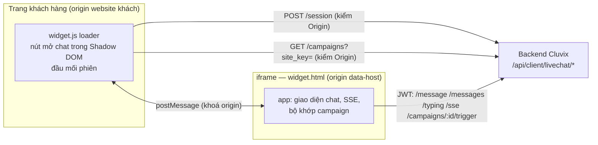
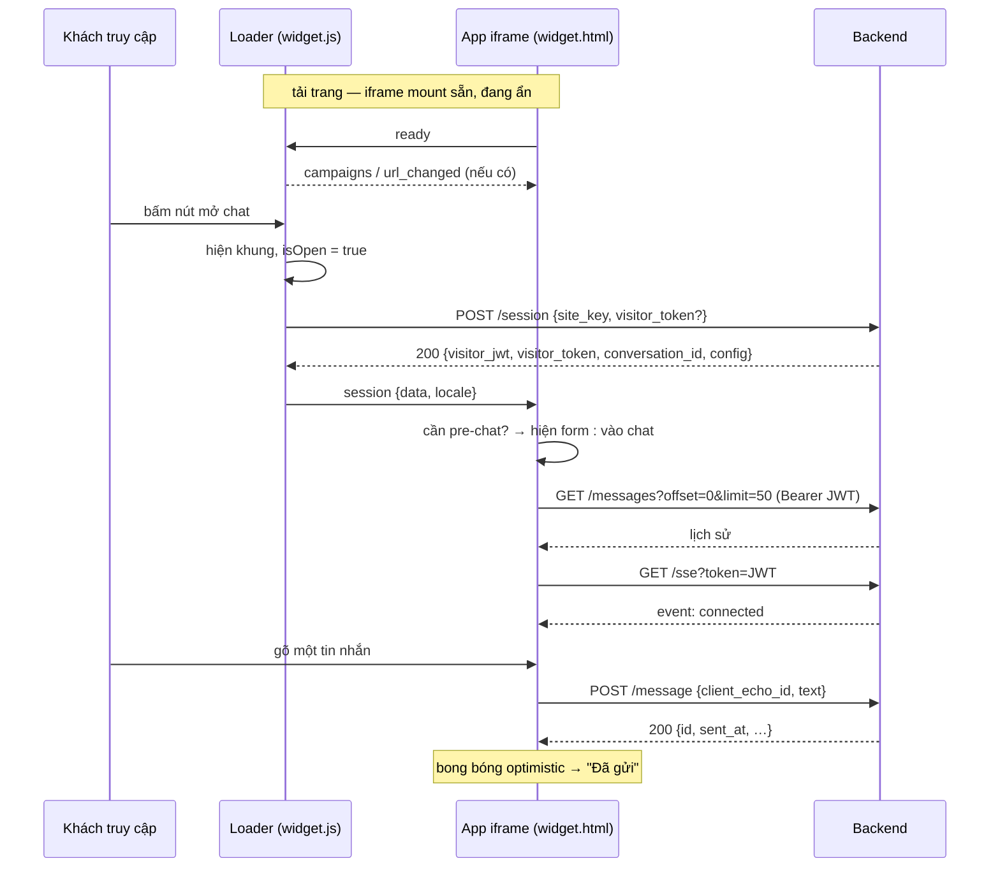
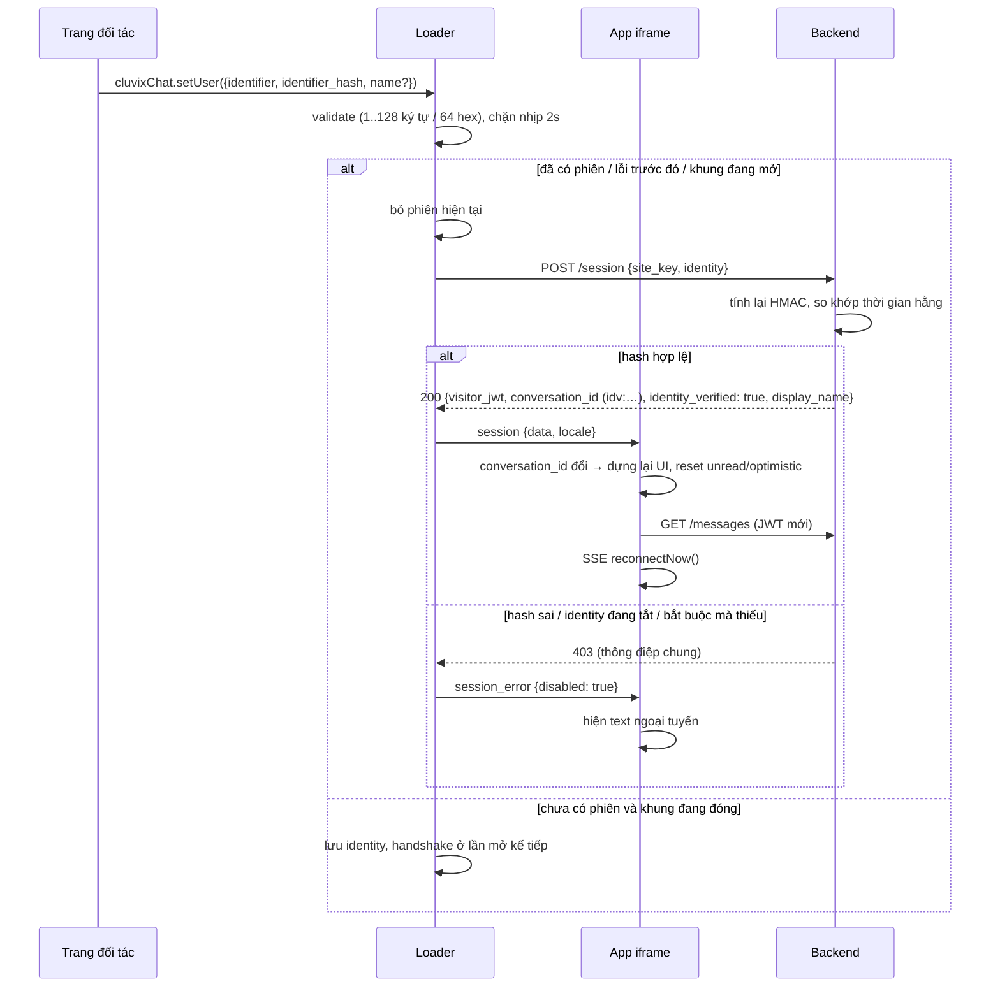

# Widget hoạt động thế nào

Mô tả đầu-cuối những gì xảy ra từ lúc khách truy cập tải trang cho tới khi câu trả lời của nhân viên hiện ra
trên trình duyệt của họ. Mọi thứ ở đây rút ra từ chính mã nguồn trong repo này (`src/`) và từ API công khai
mà nó gọi; chỗ nào là hằng số phía backend đều được ghi rõ.

> Thuật ngữ: **loader** = `widget.js`, chạy trên trang của khách hàng (origin của website khách). **app** =
> `widget.html` + bundle của nó, chạy bên trong iframe (origin backend, tức `data-host`). **admin** = ứng
> dụng web Cluvix, nơi quản trị viên phòng khám cấu hình site.

- [1. Tải trang → nút mở chat](#1-tải-trang--nút-mở-chat)
- [2. Mở khung → handshake](#2-mở-khung--handshake)
- [3. Pre-chat → tin đầu tiên](#3-pre-chat--tin-đầu-tiên)
- [4. Realtime (SSE)](#4-realtime-sse)
- [5. Nhân viên trả lời](#5-nhân-viên-trả-lời)
- [6. Định danh (`setUser`)](#6-định-danh-setuser)
- [7. Chiến dịch chủ động](#7-chiến-dịch-chủ-động)
- [8. Lưu trữ phía client](#8-lưu-trữ-phía-client)
- [9. Rate limit và các trần cứng](#9-rate-limit-và-các-trần-cứng)
- [10. Locale, theme, chế độ tối](#10-locale-theme-chế-độ-tối)
- [Tra cứu postMessage](#tra-cứu-postmessage)

---

## Vì sao có hai bundle

`POST /session` được bảo vệ bằng danh sách `Origin` cho phép, cấu hình theo từng site. Chỉ request phát ra
**từ trang của khách hàng** mới mang đúng `Origin` đó. Iframe được phục vụ từ origin Cluvix, nên handshake
phát từ trong iframe sẽ luôn bị từ chối. Vì vậy:

- **loader** giữ handshake, resume token, identity và danh sách campaign;
- **app** giữ giao diện hội thoại và mọi thứ cần visitor JWT (`/message`, `/messages`, `/typing`, `/sse`,
  `/campaigns/:id/trigger`) — các endpoint đó xác thực bằng JWT và **không** kiểm `Origin`;
- hai bên nói chuyện qua kênh `postMessage` khoá origin (`cluvix-livechat`).



---

## 1. Tải trang → nút mở chat

1. Thẻ `<script src=".../widget.js" data-site-key="..." data-host="..." async>` chạy.
2. `readBootstrap()` (`src/loader/bootstrap.ts`) đọc các thuộc tính trên `document.currentScript` (hoặc, với
   thẻ `async` đã mất `currentScript`, trên `script[data-site-key][src*="widget.js"]`):
   - `data-site-key` — bắt buộc. Thiếu → `console.error` và widget **không** mount.
   - `data-host` — tuỳ chọn. Phải là origin thuần (`u.origin === giá trị`: không path, query, hash hay
     thông tin đăng nhập). `https:` luôn được nhận; `http:` chỉ cho `localhost` / `127.0.0.1`. Sai →
     `console.error` và widget **không** mount. Bỏ trống → dùng origin nơi `widget.js` được phục vụ.
   - `data-user-id` / `data-user-hash` / `data-user-name` / `data-user-phone` / `data-user-email` —
     identity tuỳ chọn. `identifier` dài 1–128 ký tự, `identifier_hash` đúng 64 ký tự hex (không phân biệt
     hoa thường, được hạ về chữ thường bên trong). Sai → `console.error` và phiên rơi về ẩn danh.
3. `createState()` dựng đối tượng `LoaderState` duy nhất, gồm các khoá lưu trữ
   (`cluvix_lc_token_<siteKey>`, `cluvix_lc_open_<siteKey>`, `cluvix_lc_cfg_<siteKey>`,
   `cluvix_lc_campaigns_<siteKey>`) và locale/theme ban đầu (lấy từ config đã cache, xem
   [§10](#10-locale-theme-chế-độ-tối)).
4. Ở `DOMContentLoaded` (hoặc ngay lập tức nếu tài liệu đã parse xong), `mount()`:
   - gắn host Shadow DOM vào `<body>` — cô lập CSS với trang chủ nhà, theo cả hai chiều;
   - vẽ nút mở chat bằng theme **đã cache**, để nút hiện đúng ngay trước mọi lời gọi mạng;
   - bật theo dõi URL cho campaign và tải danh sách campaign (độc lập với handshake);
   - **mount iframe NGAY nhưng ẩn** (`frameWrap.hidden` vẫn true). Bắt buộc như vậy để bộ đếm giờ campaign
     trong app chạy được kể cả khi widget đang đóng. Iframe ẩn **không** tự handshake — xem dòng `ready`
     trong [tra cứu postMessage](#tra-cứu-postmessage);
   - đặt `mounted = true`, phát `cluvix-chat:ready`, rồi chạy nốt các lời gọi `window.cluvixChat` đã xếp
     hàng trước khi mount;
   - khôi phục trạng thái mở nếu tab trước để mở (`cluvix_lc_open_<siteKey> === '1'`) — **chỉ trên
     desktop** (`matchMedia('(max-width: 480px)')` sai), để không chiếm màn hình điện thoại.

Tới đây chưa có handshake, chưa có hội thoại, và không có cookie nào được tạo.

---

## 2. Mở khung → handshake

Việc mở đến từ cú bấm nút, `window.cluvixChat.open()`, hoặc một cú click vào campaign preview.
`frame.open()` hiện khung đầy đủ rồi gọi `ensureSession()`, hàm này chạy handshake trừ khi đã có một lượt
đang bay hoặc đã có phiên.

`POST {data-host}/api/client/livechat/session`, `Content-Type: application/json`:

```json
{ "site_key": "…", "visitor_token": "…", "pre_chat": { "name": "…", "phone": "…" }, "identity": { "…": "…" } }
```

- `visitor_token` chỉ được gửi khi KHÔNG có identity (identity và token ẩn danh đã lưu không bao giờ đi
  cùng nhau — backend cũng sẽ bỏ qua token khi có identity).
- `pre_chat` chỉ có mặt ở lượt handshake ngay sau khi gửi form pre-chat.

Thứ tự phía server (`internal/modules/public/livechat/handler.go`):

1. parse body → bắt buộc có `site_key`;
2. kiểm **định dạng** `site_key` (1–64 ký tự, `[A-Za-z0-9_-]`) *trước* khi chạm Redis hay DB;
3. rate limit theo `(site_key, IP)`;
4. resolve site từ `site_key`;
5. `status` của site phải là `connected`;
6. header `Origin` phải khớp `allowed_origins` (chuẩn hoá 2 phía: hạ chữ thường, bỏ dấu `/` cuối, bỏ port
   mặc định `:443`/`:80`). Thiếu `Origin`, hoặc danh sách cho phép rỗng, đều là từ chối;
7. validate pre-chat (tên ≤ 100 ký tự, SĐT phải hợp lệ nếu có);
8. verify identity, khi có ([§6](#6-định-danh-setuser));
9. resume hoặc tạo hội thoại, tuỳ chọn tự liên kết khách hàng đã có theo SĐT;
10. ký visitor JWT (HS256, `aud = livechat-visitor`, `sub` = id hội thoại, **TTL 1 giờ**).

Mọi thất bại ở bước 4–8 trả về **cùng một** thân 403 chung. Lý do thật chỉ nằm trong nhật ký bảo mật của
server (`livechat_site_rejected` / `livechat_identity_rejected`), không bao giờ trong response — xem
[Khắc phục sự cố](./TROUBLESHOOTING.md#không-kết-nối-được--403).

`.data` của response mang `visitor_jwt`, `visitor_token`, `conversation_id`, `identity_verified`,
`display_name`, và `config` (`widget_theme`, `pre_chat_form`). Loader cache config, áp theme lên nút mở
chat, rồi gửi `session` (kèm locale đã chốt) vào iframe.



---

## 3. Pre-chat → tin đầu tiên

Form pre-chat hiện khi `pre_chat_form.enabled` **và** ít nhất một trong `require_name` / `require_phone` /
`require_message` bật **và** cờ "đã hoàn tất pre-chat" của `site_key` này chưa được đặt.

- Validate chạy phía client để phản hồi nhanh; backend vẫn là nguồn chân lý. Tên: ít nhất một ký tự không
  trắng. SĐT: `phone_region === 'INTL'` → chỉ E.164 (`^\+?[1-9]\d{6,14}$`); ngược lại chấp nhận số di động
  Việt Nam (`^(?:\+84|0)(?:3|5|7|8|9)\d{8}$`) **hoặc** E.164. Khoảng trắng, dấu chấm, gạch ngang và ngoặc
  đơn bị bỏ trước khi khớp. Tin nhắn: ít nhất một ký tự không trắng.
- Nút **Gửi tin nhắn** vẫn bị vô hiệu cho tới khi mọi ô *đang hiện* đều hợp lệ. `Enter` ở ô tin nhắn là
  gửi (`Shift+Enter` xuống dòng).
- Khi submit, app gửi `handshake` kèm `pre_chat: {name?, phone?}` lên loader. Nội dung tin nhắn **không**
  nằm trong handshake (API không có trường đó): nó được giữ trong bộ nhớ và gửi thành `POST /message` đầu
  tiên ngay sau khi vào chat, có cờ `firstMessageSent` chặn để một lượt re-handshake sau đó không gửi lặp.
- Gửi tin theo kiểu optimistic: bong bóng hiện ngay với `client_echo_id` do client sinh
  (`crypto.randomUUID()` khi có). Thành công thì bong bóng được ack bằng id server và hiện "Đã gửi". Lỗi
  HTTP hoặc `429` thì hiện "Gửi lỗi · chạm để thử lại" và giữ nguyên `client_echo_id`, nên lần thử lại
  được server khử trùng lặp. Gặp `401` (JWT hết hạn) thì bong bóng ở nguyên trạng thái "đang gửi", một
  lượt re-handshake được xin, và tin được gửi lại khi có JWT mới — khách không thấy gì bất thường.

---

## 4. Realtime (SSE)

Sau khi lịch sử nạp xong, app mở `GET /api/client/livechat/sse?token=<visitor_jwt>` bằng `EventSource`
(JWT đi trong query string vì `EventSource` không đặt được header `Authorization`).

| Sự kiện | Ý nghĩa | App làm gì |
|---|---|---|
| `connected` | Đã mở kết nối. | Bật chấm "đang hoạt động" ở header, reset backoff. Nếu lần mất kết nối trước kéo dài **> 3 s** thì nạp lại lịch sử để bù tin lỡ. |
| `new_message` | Một tin của nhân viên. Payload `{message: …}`. | Thêm bong bóng, tăng số chưa đọc khi khung đang đóng, và báo loader (`staff_message`) để loader phát `cluvix-chat:message` — **chỉ** metadata, không bao giờ có nội dung. |
| `staff_typing` | Nhân viên đang gõ. | Hiện chỉ báo đang gõ. |
| `:ping` | Comment SSE giữ nhịp, mỗi **25 s**. | `EventSource` tự bỏ qua theo spec; nó tồn tại để reverse proxy không đóng một stream đang im lặng. |
| `expired` | Server gửi ở nhịp heartbeat sau khi JWT hết hạn, ngay trước khi đóng stream. | Xin re-handshake NGAY, thay vì suy đoán hết hạn từ lỗi kết nối. |

Việc kết nối lại do widget tự quản, không dùng cơ chế retry sẵn của `EventSource` (nó không đổi được URL
nên sẽ dùng lại mãi cái JWT đã chết): khi `error` thì đóng stream rồi kết nối lại với backoff luỹ thừa
**2 s → 30 s** (nhân đôi, có trần). Hai lỗi liên tiếp *trước khi* kịp `connected` được coi là JWT đáng ngờ
và kích một lượt re-handshake. `reconnectNow()` (dùng khi có phiên mới) reset backoff và kết nối lại ngay.

Phía server, stream cũng có trần: số subscribe bị giới hạn theo IP và theo tổng, và một kết nối không nhận
sự kiện nào trong khoảng idle sẽ bị bộ quét đóng — xem [§9](#9-rate-limit-và-các-trần-cứng).

---

## 5. Nhân viên trả lời

Nhân viên trả lời trong hộp thư Omnichat của Cluvix (**trong app Cluvix** — nằm ngoài repo này). Backend
lưu tin rồi đẩy xuống stream SSE của khách, tới nơi thành `new_message`. Nếu khung đang đóng, app gửi
`unread` cho loader để vẽ badge (tối đa hiển thị `9+`). Mở lại khung thì số chưa đọc về 0.

Hai lớp bảo vệ độc lập giữ ghi chú nội bộ (`src = 2`) tránh xa khách: một lớp trước khi publish SSE, một
lớp trong truy vấn lịch sử. Widget cũng từ chối render `src = 2` như một lớp phòng thủ nữa.

---

## 6. Định danh (`setUser`)

Mặc định là ẩn danh. Có identity thì cùng một người sẽ có cùng một hội thoại xuyên thiết bị.

- **Server của bạn** tính `identifier_hash = hex(HMAC-SHA256(identity_secret, identifier))`. Secret không
  bao giờ tới trình duyệt.
- Trang nhúng cặp `(identifier, identifier_hash)` qua `data-user-*` hoặc `window.cluvixChat.setUser({…})`.
- Backend tính lại HMAC và so khớp theo thời gian hằng. Thành công thì khoá hội thoại là `idv:` +
  `hex(sha256(identifier))` — bản thân identifier không được lưu, nên không thể lần ngược từ hội thoại ra
  email.
- Mọi `visitor_token` gửi kèm đều bị **bỏ qua** khi có `identity`: nếu không, ai có một identity hợp lệ sẽ
  "nhảy" được vào một hội thoại ẩn danh mà họ tình cờ biết token.
- `name` / `phone` / `email` trong `identity` **không** nằm trong chữ ký. Chúng chỉ là gợi ý và chỉ điền
  vào chỗ còn trống; không bao giờ ghi đè tên mà nhân viên đã sửa. `email` được API nhận nhưng chưa lưu ở
  v2.
- Nếu site bật `identity_mandatory`, handshake không kèm `identity` sẽ bị từ chối. Nếu site **tắt** identity
  mà trang vẫn gửi `identity`, cũng bị từ chối — cố ý không âm thầm hạ về ẩn danh, vì khi đó trang sẽ tưởng
  mình đang chạy chế độ xác thực trong khi thực tế thì không.
- `setUser` bị chặn nhịp còn 1 lần / 2 giây, và là no-op khi cả `identifier` lẫn `identifier_hash` trùng
  identity đang áp *và* lượt handshake trước không lỗi.
- Identity chỉ nằm **trong bộ nhớ** — không bao giờ vào `localStorage`/`sessionStorage`. Tải lại trang mà
  không cấp lại thì bắt đầu một phiên ẩn danh mới. Tương tự, `visitor_token` trả về cho phiên đã xác thực
  **không** được lưu: phiên đã xác thực resume bằng identifier, không bằng token.



---

## 7. Chiến dịch chủ động

Tóm tắt ở đây; hành vi đầy đủ nằm trong [CAMPAIGNS.md](./CAMPAIGNS.md).

1. Loader gọi `GET /campaigns?site_key=` (không JWT — campaign phải xuất hiện được *trước* khi có bất kỳ
   hội thoại nào) và cache danh sách trong `localStorage` **1 giờ**.
2. Loader gửi danh sách vào iframe, kèm URL hiện tại, và tiếp tục gửi `url_changed` mỗi khi trang chủ nhà
   điều hướng — kể cả điều hướng SPA (`pushState`/`replaceState` được bọc lại, có nghe `popstate`/
   `hashchange`, và một `MutationObserver` phủ nốt các router không dùng thứ nào ở trên).
3. App khớp `url_pattern` với URL rồi hẹn giờ `time_on_page` giây.
4. Khi hẹn giờ nổ và các điều kiện chặn đều đạt (khung đang đóng, phiên chưa có tin nào, không trong
   snooze, không có preview khác đang chờ/đang hiện), app xin loader **tải lại danh sách bỏ qua cache**, để
   không hiện một campaign mà admin vừa tắt, rồi mới vẽ compact preview — một bong bóng nhỏ chứa nội dung
   và người gửi, nằm đúng chỗ khung chat sẽ hiện. Không hội thoại nào được tạo.
5. Bấm vào preview sẽ mở khung đầy đủ (hiện pre-chat trước nếu cần), handshake, rồi gọi
   `POST /campaigns/:id/trigger` để tạo tin mở đầu đúng một lần. Bấm **X** để tắt sẽ snooze campaign của
   site này **1 giờ**.

---

## 8. Lưu trữ phía client

Không có gì ở đây là cookie, và không có gì là bên thứ ba. Các khoá đều gắn tên theo `site_key`.

| Khoá | Ở đâu | Ai ghi | Vòng đời | Mục đích |
|---|---|---|---|---|
| `cluvix_lc_token_<siteKey>` | `sessionStorage` khi `pre_chat_form.enabled`, ngược lại `localStorage` | loader | phiên tab / **30 ngày** (lưu dạng `{token, ts}`, kiểm khi đọc) | Resume hội thoại ẩn danh. Không bao giờ ghi cho phiên đã xác thực (identity). |
| `cluvix_lc_open_<siteKey>` | `localStorage` | loader | tới khi bị xoá | Nhớ trạng thái mở/đóng của khung (chỉ khôi phục trên desktop). |
| `cluvix_lc_cfg_<siteKey>` | `localStorage` | loader | tới khi bị xoá | Cache `config` để nút mở chat vẽ đúng màu/nhãn trước khi handshake trả về. |
| `cluvix_lc_campaigns_<siteKey>` | `localStorage` | loader | **1 giờ** (`{ts, list}`) | Cache danh sách campaign. |
| `cluvix_lc_prechat_<siteKey>` | `sessionStorage` khi `pre_chat_form.enabled`, ngược lại `localStorage` | app (origin iframe) | phiên tab / tới khi bị xoá | "Đã hoàn tất pre-chat", để không hỏi lại form. Khi đọc có fallback sang storage kia để tương thích ngược. |
| `cluvix_lc_snooze_<siteKey>` | `localStorage` (origin iframe) | app | **1 giờ** (mốc thời gian tuyệt đối) | Snooze campaign sau khi khách đóng preview. |

Việc tách `sessionStorage` và `localStorage` là có chủ đích: trên site có form pre-chat, hội thoại nhiều
khả năng chứa thông tin cá nhân hoặc y tế, nên trên **máy dùng chung** người sau không được phép mở lại nó
từ đĩa. Mọi lượt truy cập storage đều bọc `try/catch` — khi storage bị chặn (chế độ ẩn danh, cấu hình siết
chặt) widget vẫn chạy được cho phiên hiện tại, chỉ là không resume được.

---

## 9. Rate limit và các trần cứng

Giá trị phía backend, lấy từ `pkg/define/omni_channel.go`. Mục nào ghi *env* thì chỉnh được theo từng bản
triển khai (xem [Vận hành](./OPERATIONS.md#biến-môi-trường-backend)).

| Giới hạn | Giá trị | Phạm vi |
|---|---|---|
| Handshake `POST /session` (và `GET /campaigns`, chung bucket) | **120 / phút** *(env `LIVECHAT_RATE_SESSION_IP`)* | `(site_key, IP)` |
| Tin nhắn của khách | **10 / phút** *(env `LIVECHAT_RATE_VISITOR`)* | hội thoại |
| Tin nhắn của khách | **30 / phút** *(env `LIVECHAT_RATE_IP`)* | `(site_key, IP)` |
| Đọc lịch sử `GET /messages` | **60 / phút** *(env `LIVECHAT_RATE_READ`)* | hội thoại |
| Cửa sổ rate limit | **60 s** trượt | — |
| Chặn nhịp `typing` | **1 lần / 3 s** | hội thoại — vượt trần trả `200` no-op im lặng, cố ý KHÔNG phải `429` |
| Nội dung tin nhắn | **4000 ký tự (rune)** | đếm theo rune chứ không phải byte, để tiếng Việt có dấu không bị cắt còn một phần ba |
| `client_echo_id` | **≤ 64 ký tự**, `[A-Za-z0-9_-]` | — |
| Tên ở pre-chat | **≤ 100 ký tự** | — |
| `site_key` | **≤ 64 ký tự**, `[A-Za-z0-9_-]` | kiểm trước khi chạm Redis/DB |
| `offset` của `GET /messages` | kẹp về **5000**; `limit` ngoài 1..100 thì về 50 | kẹp chứ không từ chối, để widget cũ không vỡ |
| Tuổi resume ẩn danh | **30 ngày** | `visitor_token` cũ hơn mốc này sẽ mở hội thoại *mới* |
| Kết nối SSE | **3 mỗi IP**, **2000 tổng** *(env `VISITOR_SSE_MAX_CONN_PER_IP`, `VISITOR_SSE_TOTAL_CAP`)* | vượt trần → `429` |
| SSE đóng do idle | **15 phút** không có sự kiện | server đóng stream; widget tự kết nối lại |
| Nhịp tim SSE | `:ping` mỗi **25 s** | — |
| TTL visitor JWT | **1 giờ** | không có danh sách thu hồi; đổi lại, site bị tắt sẽ bị chặn ở mọi endpoint có xác thực |

Hai quyết định thiết kế nên biết khi đọc các con số trên:

- **Rate limit fail-open.** Redis không sẵn sàng thì request được cho qua chứ không bị chặn — một bộ đếm
  hỏng không được phép làm chết cả kênh chat.
- **Tầng theo IP tự tắt khi IP không đáng tin.** Sau reverse proxy mà `TRUSTED_PROXIES` chưa set thì mọi
  request đều trông như `127.0.0.1`; thay vì biến "per-IP" thành một bucket toàn cục khoá luôn khách thật,
  mã coi IP loopback/rỗng là "không biết", bỏ tầng IP, và ghi một cảnh báo mỗi tiến trình. Các tầng không
  theo IP (theo hội thoại, theo site) vẫn chạy. Đó là lý do `TRUSTED_PROXIES` quan trọng.

---

## 10. Locale, theme, chế độ tối

**Locale** được chốt một lần, khớp đầu tiên thắng: `widget_theme.locale` (do admin đặt) → `<html lang>` của
trang chủ nhà → `navigator.language` → `vi`. Chỉ loader đọc được `lang` của trang chủ nhà (iframe khác
origin), nên loader chốt rồi gửi kèm message `session`; app đặt `document.documentElement.lang` tương ứng
và định dạng giờ của tin nhắn bằng `Intl.DateTimeFormat` theo locale đó. Giá trị được khớp theo subtag gốc,
nên `en-GB` ra `en`. Hỗ trợ: `vi` (mặc định) và `en`, đều LTR.

**Theme.** `widget_theme` đến từ handshake; loader cũng giữ bản gần nhất trong `cluvix_lc_cfg_<siteKey>` để
nút mở chat được vẽ đúng trước khi mạng trả lời. Thứ gì theme không đặt thì rơi về mặc định theo locale
(`primary_color: #1677ff`, `position: right`, và chuỗi chào/ngoại tuyến đã dịch). `launcher_offset_x/y`
được làm tròn và kẹp trong `0..200`, mặc định `20`; giá trị không hữu hạn thì về mặc định.

**Tương phản.** `primary_color` chỉ được dùng nguyên vẹn cho các chi tiết không có chữ (viền focus,
highlight). Với mọi bề mặt có chữ, widget làm tối màu theo bước 1% (tối đa 50 bước, tức xuống còn khoảng
60% độ sáng gốc) cho tới khi chữ trắng đạt WCAG 2.1 AA (4.5:1), rồi chọn trắng hoặc `#111827` — bên nào
tương phản tốt hơn. Màu thương hiệu rất sáng thì không bị làm tối tới mức không nhận ra — chúng giữ nguyên
màu và nhận chữ tối. Độ sáng tương đối theo đúng định nghĩa WCAG (linearize sRGB,
`0.2126R + 0.7152G + 0.0722B`), không dùng xấp xỉ YIQ cũ.

**Chế độ tối.** Mọi màu trung tính là CSS custom property có bảng màu tối. `color_scheme: 'auto'` (mặc
định) theo hệ điều hành của khách qua `prefers-color-scheme`; `'light'`/`'dark'` ép cứng bằng cách đặt
`data-lc-scheme` trên phần tử gốc của iframe. Vòng viền badge chưa đọc theo cùng quyết định đó, nên nó
không thành một quầng trắng lạc lõng trên trang nền tối.

**Di động.** Dưới 480 px khung chat là toàn màn hình và loader ghim nó theo `window.visualViewport`, để ô
soạn tin luôn nằm trên bàn phím ảo iOS (Safari iOS không thu nhỏ layout viewport khi bàn phím bật). Compact
preview của campaign và desktop giữ nguyên layout CSS.

---

## Tra cứu postMessage

Kênh: mọi message đều mang `channel: 'cluvix-livechat'`; thứ khác bị bỏ qua (iframe khác và tiện ích mở
rộng cũng postMessage). Cả hai phía đều ghim origin: loader chỉ nhận message có `event.origin` bằng origin
widget, còn app chốt `trustedOrigin` từ message hợp lệ đầu tiên nhận được và từ chối mọi message sau đó đến
từ origin khác. App không bao giờ post tới `'*'`; trước khi biết origin, chỉ `ready` được phép dùng phỏng
đoán từ `document.referrer`, và bị bỏ hẳn khi không có referrer.

### iframe → loader

| Loại | Payload | Ý nghĩa / loader phản ứng |
|---|---|---|
| `ready` | — | App đã mount. Loader đánh dấu iframe sẵn sàng, dùng nốt yêu cầu focus đang chờ, gửi lại `session` hoặc `session_error` hiện tại, gửi lại `opened` nếu khung đã mở, và gửi lại danh sách campaign + URL. Cố ý **không** handshake ở đây — iframe được mount sẵn ở mọi lượt tải trang, nên handshake theo `ready` sẽ tạo hội thoại cho cả những khách chưa từng mở chat. |
| `handshake` | `pre_chat?: {name?, phone?}` | Xin (re)handshake: gửi pre-chat, hoặc làm mới JWT (không payload). Nếu khung đang đóng thì loader hiện khung đầy đủ trước, để form pre-chat không loé lên trong compact preview. |
| `close` | — | Khách bấm nút đóng trong khung (hoặc `Escape`). |
| `unread` | `count` | Số tin chưa đọc khi khung đóng → badge. |
| `campaign_ready` | `campaignId` | Chỉ là tín hiệu để quan sát — toàn bộ luồng preview do iframe tự xử lý. |
| `set_compact_view` | `height` | Thu khung về compact preview đúng chiều cao đó (tối thiểu 60 px). Loader sở hữu Shadow DOM nên loader thực thi resize; `isOpen` vẫn `false`. |
| `exit_compact_view` | `reason?: 'open' \| 'dismiss'` | `'open'` → chuyển sang khung đầy đủ ngay (trước khi handshake chạy). `'dismiss'`/không có → ẩn khung, widget vẫn đóng. |
| `refetch_campaigns` | — | Tải lại danh sách campaign bỏ qua cache; kết quả quay về bằng message `campaigns` như thường. |
| `staff_message` | `id`, `sent_at` | Có tin của nhân viên qua SSE. Loader phát `cluvix-chat:message` với `{conversation_id, sent_at}` — cố ý chỉ metadata, không bao giờ nội dung, và không bao giờ ghi chú nội bộ. |

### loader → iframe

| Loại | Payload | Ý nghĩa |
|---|---|---|
| `session` | `data: SessionData`, `locale?` | Handshake thành công. Mang `visitor_jwt`, `conversation_id`, `config`, `identity_verified`, `display_name`. `conversation_id` đổi thì app dựng lại UI và nạp lại lịch sử. |
| `session_error` | `disabled: boolean` | Handshake thất bại. `disabled: true` (403 / không có envelope) → hiện `offline_text` của site; ngược lại hiện chuỗi "không kết nối được" chung. |
| `opened` | — | Khung vừa được mở (kể cả qua public API). Reset số chưa đọc, focus ô soạn tin nếu đang ở màn chat. |
| `closed` | — | Khung bị đóng từ bên ngoài. |
| `campaigns` | `list: CampaignPreview[]` | Danh sách campaign `enabled` — gửi ở mọi lượt fetch mới *và* cả khi cache hit, để app tính lại theo URL hiện tại. |
| `url_changed` | `url` | URL trang chủ nhà vừa đổi (kể cả điều hướng SPA). App xoá hết timer campaign rồi đặt lại theo URL mới. |

### Sự kiện công khai trên `window` (trang chủ nhà)

`cluvix-chat:ready`, `cluvix-chat:opened`, `cluvix-chat:closed`, `cluvix-chat:message`. Chỉ `message` mang
`detail`: `{conversation_id, sent_at}`. Xem [Public JS API](../../README.vi.md#public-js-api).

---

## Xem thêm

- [Vận hành](./OPERATIONS.md) — tạo site, biến môi trường, nginx, deploy, rollback.
- [Khắc phục sự cố](./TROUBLESHOOTING.md) — triệu chứng → nguyên nhân → cách kiểm → cách sửa.
- [Chiến dịch](./CAMPAIGNS.md) — cấu hình tin chủ động và luật khớp.
- [README](../../README.vi.md) — cách nhúng, data attributes, contract API, ghi chú bảo mật.
